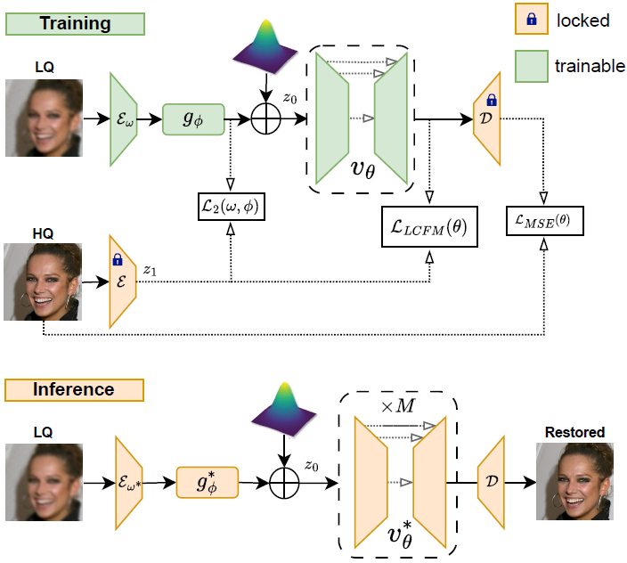
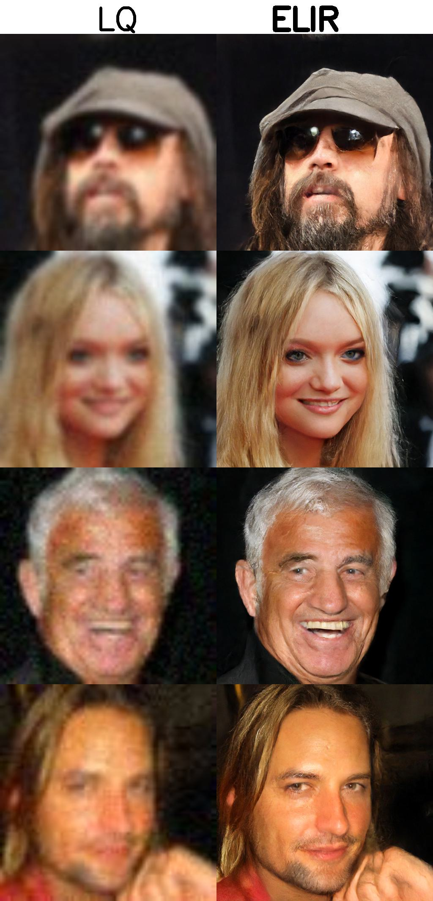
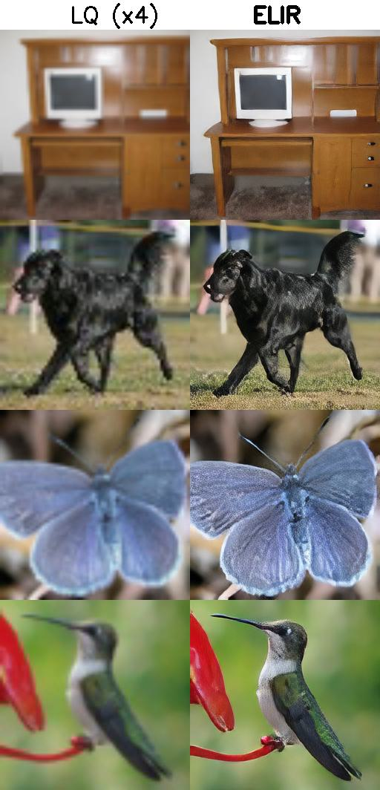
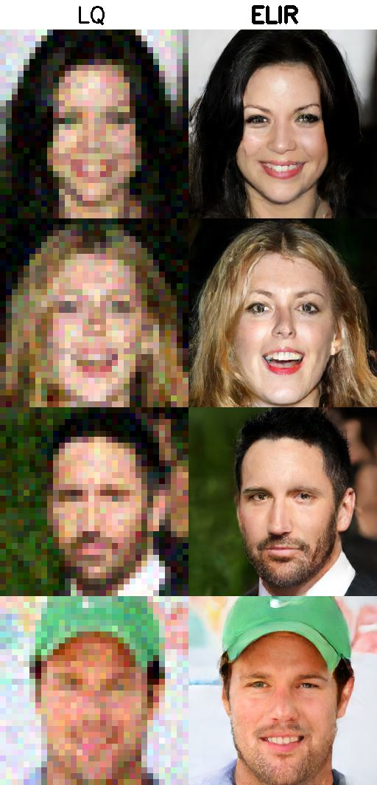
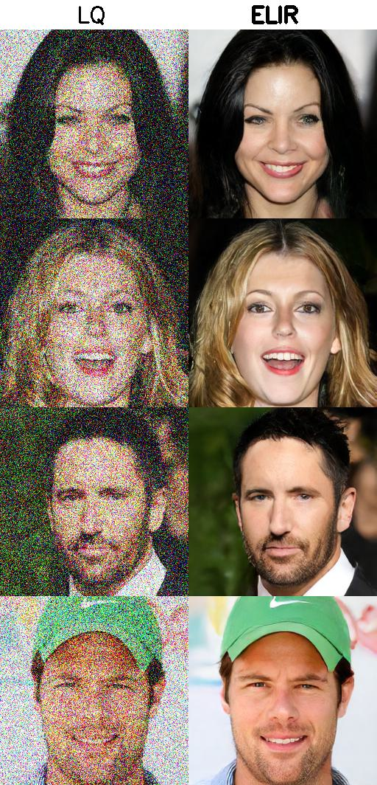
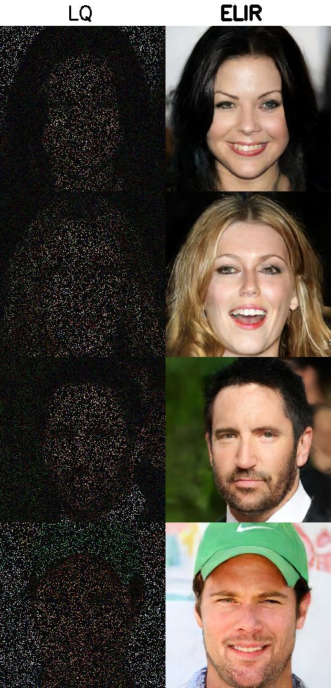

# Efficient Image Restoration via Latent Consistency Flow Matching

## 📄 Paper 
TBD

## Abstract
Recent advances in generative image restoration (IR) have demonstrated impressive
results. However, these methods are hindered by their substantial size and computational
demands, rendering them unsuitable for deployment on edge devices. This work
introduces ELIR, an Efficient Latent Image Restoration method. ELIR addresses the
distortion-perception trade-off within the latent space and produces high-quality images
using a latent consistency flow-based model. In addition, ELIR introduces an efficient
and lightweight architecture. Consequently, ELIR is 4x smaller and faster than stateof-
the-art diffusion and flow-based approaches for blind face restoration, enabling a deployment
on resource-constrained devices. Comprehensive evaluations of various image
restoration tasks and datasets show that ELIR achieves competitive performance compared
to state-of-the-art methods, effectively balancing distortion and perceptual quality
metrics while significantly reducing model size and computational cost.



## Visual Results
### :point_right: Blind Face Restoration          $~~~~~~~~~~~~~~~~~~~~~~~~~~~~~~~~~~~~~~$:point_right: Blind Super Resolution (x4)
       

### :point_right: Super Resolution (x8)           $~~~~~~~~~~~~~~~~~~~~~~~~~~~~~~~~~~~~~~$:point_right: Denoising
      


### :point_right: Inpainting                     



## Installation
To install the necessary dependencies, run the following commands:
 ```shell script
 git clone https://github.com/yourusername/ELIR.git
 cd ELIR
 pip install -r requirements.txt
 ```

## 💾 Training Datasets
### 🧑🏻 FFHQ
FFHQ contains 70k high-quality PNG face images at 1024x1024 resolution, diverse in age, ethnicity, and background.
  * Download: https://github.com/NVlabs/ffhq-dataset

### 🌄 ImageNet-Training
ImageNet-1K contains 1.2M general-contnet images at different shapes.
 * Download: https://image-net.org/index.php

## 💾 Testing Datasets
### CelebA, LFW
Synthesised and in-the-wild face images.
  * Download: https://xinntao.github.io/projects/gfpgan

### ImageNet-Validation, RealSet80
Synthesised and real-world imges.
  * Download: https://github.com/zsyOAOA/ResShift

## 📈 Evaluation Metrics
Evaluation is done by Image Quality Assessment (IQA) toolbox for pytorch taken from 
https://github.com/chaofengc/IQA-PyTorch


## 💻 Training
1. **Configuration**: Edit the yml configuration file:
   * Set `out_dir` to your desired output directory.
   * Set `train_dataset` to your training dataset path.
   * Set `val_dataset` to your validation dataset path.
2. **Training**: Execute the training script for the specific task:
### Face Restoration
* Blind Face Restoration: 
    ```shell script
    python train.py -y configs/elir_train_bfr.yml
    ```
* Super Resolution (x8): 
    ```shell script
    python train.py -y configs/elir_train_sr.yml
    ```
* Denoising: 
    ```shell script
    python train.py -y configs/elir_train_denoising.yml
    ```
* Inpainting: 
    ```shell script
    python train.py -y configs/elir_train_inpainting.yml
    ```

### Image Restoration
* Blind Super Resolution (x4): 
    ```shell script
    python train.py -y configs/elir_train_bsr.yml
    ```
## ⬇️ Pre-trained models

|          Task          |                                              Model Weight                                              | 
|:----------------------:|:------------------------------------------------------------------------------------------------------:| 
| blind face restoration |        [elir_bfr.pth](https://github.com/ssi-research/ELIR/releases/download/v1.0/elir_bfr.pth)        |
|    super resolution    |         [elir_sr.pth](https://github.com/ssi-research/ELIR/releases/download/v1.0/elir_sr.pth)         |
|       denoising        |  [elir_denoising.pth](https://github.com/ssi-research/ELIR/releases/download/v1.0/elir_denoising.pth)  |
|       inpainting       | [elir_inpainting.pth](https://github.com/ssi-research/ELIR/releases/download/v1.0/elir_inpainting.pth) |
| blind super resolution |        [elir_bsr.pth](https://github.com/ssi-research/ELIR/releases/download/v1.0/elir_bsr.pth)        |


## 🔬 Evaluation
1. **Configuration**: Edit the yml configuration file:
   * Set `path` to the path of the trained model.
   * Set `val_dataset` to your validation dataset path.
2. **Evaluation**: Execute the evaluation script for the specific task:
### Face Restoration
* Blind Face Restoration: 
    ```shell script
    python eval.py -y configs/elir_infer_bfr.yml
    ```
* Super Resolution (x8): 
    ```shell script
    python eval.py -y configs/elir_infer_sr.yml
    ```
* Denoising: 
    ```shell script
    python eval.py -y configs/elir_infer_denoising.yml
    ```
* Inpainting: 
    ```shell script
    python eval.py -y configs/elir_infer_inpainting.yml
    ```
  
### Image Restoration
* Blind Super Resolution (x4): 
    ```shell script
    python eval.py -y configs/elir_infer_bsr.yml
    ```
  
## ✈️ Inference

1. **Configuration**: Edit the yml configuration file:
   * Set `path` to the path of the trained model.
   * Set `in_folder` and `out_folder` to the directory containing your low-quality images and for output.
2. **Inference**: Execute the inference script for the specific task:
### Face Restoration
* Blind Face Restoration: 
    ```shell script
    python infer.py -y configs/elir_infer_bfr.yml
    ```
* Super Resolution (x8): 
    ```shell script
    python infer.py -y configs/elir_infer_sr.yml
    ```
* Denoising: 
    ```shell script
    python infer.py -y configs/elir_infer_denoising.yml
    ```
* Inpainting: 
    ```shell script
    python infer.py -y configs/elir_infer_inpainting.yml
    ```

### General-Content Restoration
* Blind Super Resolution (x4):
    ```shell script
    python infer.py -y configs/elir_infer_bsr.yml
    ```
## 📝 Citation

If you find this project useful, please consider cite:

```BibTeX
@article{cohen2025efficient,
  title={Efficient Image Restoration via Latent Consistency Flow Matching},
  author={Cohen, Elad and Achituve, Idan and Diamant, Idit and Netzer, Arnon and Habi, Hai Victor},
  journal={arXiv preprint arXiv:2502.03500},
  year={2025}
}
```
****


## 👍 Thanks
**Tiny AutoEncoder for Stable Diffusion:** https://github.com/madebyollin/taesd